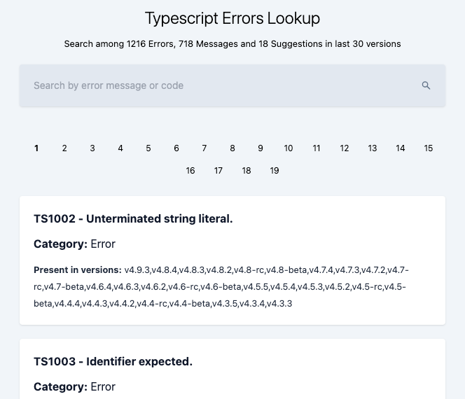
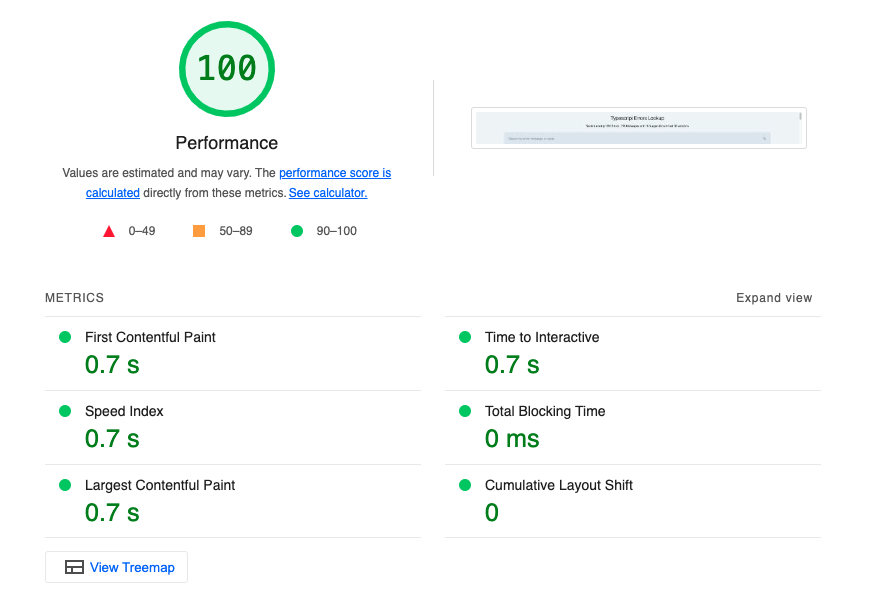
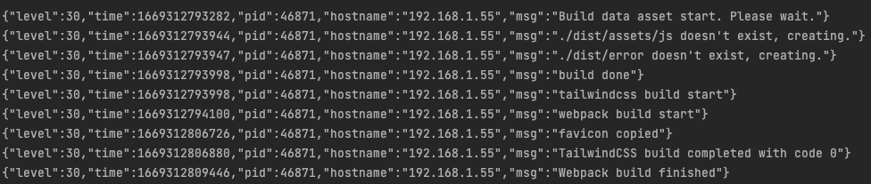
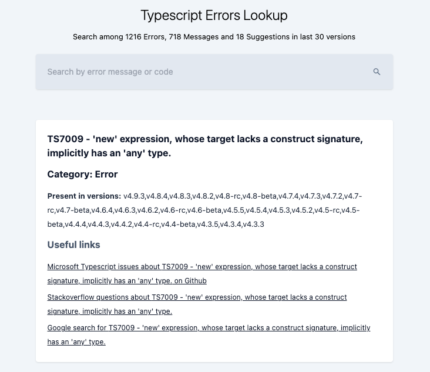

# **Typescript error lookup**

## Overview

React 18 offer [new features for SSR with react-dom](https://reactjs.org/blog/2022/03/08/react-18-upgrade-guide.html#updates-to-server-rendering-apis), this repository is an attempt to explore the benefits and the downside of this approach.
The main idea is to automatize the creation of a static website, getting data from external sources and optimizing the output.

For this little experiment I choose Typescript error messages as a topic (and data to populate the website).

Here you can check [a demo of the generated website](https://typescript-errors-lookup.s3.eu-central-1.amazonaws.com/index.html)

## Project Brief

Build a static website with 1000+ pages with optimized page load:

- Get data from Typescript GitHub repository and GitHub API
- Refine data for frontend usage and optimization
- Compile a large number of static HTML files and related assets

## Project Execution

### Technologies Used

- Typescript
- Node JS
- React 
- ReactDOM
- Webpack
- Tailwind
- Github API
- Eslint
- Prettier

### Approach Taken

#### Get the data

To get the data a Node.js script start by [collecting the tags of Typescript repository using the GitHub public API](https://api.github.com/repos/microsoft/TypeScript/tags).
This source will provide only the last repository tags but it will be sufficient for this example.
Next step is to retrieve [every message per tags from the `diagnosticMessages.json` file inside Typescript compiler](https://github.com/microsoft/TypeScript/blob/v4.9.3/src/compiler/diagnosticMessages.json).
The last step is to save all this raw data inside separated json files, in this way the next steps of the process will be independent and will not stress too much the API endpoint.   

#### Refine the data

From the raw json a second Node.js script will create the json for the React application.
Considering the main goal of optimizing page load time the main objectives were:

- reduce the average file size as much as possible
- split the data in multiple files to parallelize downloads and benefit from cache on the browser

A single error message contains the following informations:

- __code__ *Numeric code for a specific error, this is unique*
- __message__ *Error description*
- __category__ *Typescript taxonomy, can be 'error', 'message' or 'suggestion'*
- __versions__ *Typescript repository tags*

To properly split this data and avoid redundant strings categories and versions were separated in different files and related to the main json.
A second step was to switch from an object to an array structure, to remove all the string key and reduce the main file weight to ~300kb.

#### Build the website

To create the website the data need to be read and provided to the client, a Node.js script handle this set of operations and generate teh static files.

##### CSS with Tailwind

This is a simple spawn of tailwind-cli command, the minify option is provided to minify the css.
This operation could probably be optimized because tailwind-cli check all the files in a specified folder for the used classes to generate the smaller css.

#### JS scripts for data

To provide the data to the client app these must be put in a global scope like window.
The most common approach is to write this data in a script tag inside the HTML but two downside for this solution:

1) all the pages will increase in size
2) shared data will not be cached from the browser

For this reason only page specific data was put inside a script tag of the generated HTML.

A possible bottleneck when converting JSON data to plain text and viceversa it's represented by a massive usage of `JSON.parse()` and `JSON.stringify`.
There some libraries that can help to handle this cases but a few improvements can help to avoid expensive operations.

1) avoid to usage of `JSON.parse()` and `JSON.stringify` inside loops
2) avoid to usage of `JSON.parse()` and `JSON.stringify` with huge data 
3) avoid to usage of `JSON.parse()` and `JSON.stringify` :smile:

Regarding the third point I was able to limit the usage by importing json when structured data was needed and reading the json files when a plain string was needed.
This approach can avoid or limit data mutation to better define the needed type in typescript.

##### Typescript with Webpack

To simplify the client js generation I choose webpack. 
To optimize the process I limited the error output inside the compiler callback, limited the scope of rules and the plugin usage.
Compression it's applied only for production.
The average time it's ~10 seconds, the main reason are the additional operations required for type checking before transpiling.
To mitigate the problem I've added (Fork TS Checker Webpack Plugin)[https://github.com/TypeStrong/fork-ts-checker-webpack-plugin] that runs type checking on a separated process.
Another option could be to avoid type checking at all, but this solution would eliminate the benefit of using Typescript.

##### HTML with Node.js and ReactDom

This is the main point of this experiment, my first try was with `renderToString()` because I had already used this method but after updating to
`renderToPipeableStream()` I saw a huge performance improvement that allow to generate ~2000 HTML files in ~1 second.

Some stream and async implementation was required to improve the process but the performance benefits justify the effort of upgrading to this new method.

In production mode the HTML is compressed to but with a small impact on the average build time.

#### Other files

In addition to the file build some other operation are handled by the script like deleting, checking and creating folder or copy static assets (ex. favicon).

## Wins and Blockers

### Wins

- +1900 HTML compiled in ~1 second with Node.js and React
- Average load time per page less than 1 second

### Blockers

- hydrateRoot still not guarantee to patch differences between client and server
- webpack build time ~10 seconds
- selective hydration is not applicable (data is already loaded)

### Visuals

